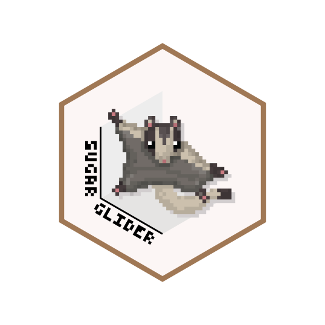
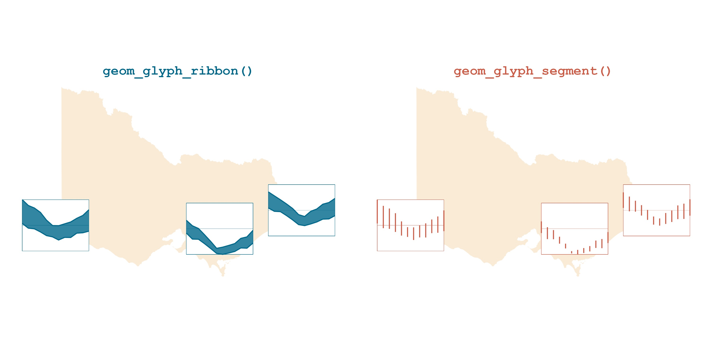

<!-- README.md is generated from README.Rmd. Please edit that file -->

```{r, include = FALSE}
knitr::opts_chunk$set(
  collapse = TRUE,
  comment = "#>",
  fig.path = "man/figures/README-",
  out.width = "100%"
)
```

# sugarglider  

<!-- badges: start -->

[](https://github.com/maliny12/sugarglider/actions/workflows/R-CMD-check.yaml)

<!-- badges: end -->

`sugarglider` provides ggplot2 extensions to create glyph maps that visualize seasonal aspects of spatio-temporal data with `geom_glyph_ribbon()` and `geom_glyph_segment()`.

These functions create a ribbon or segment geometry designed to display glyphs based on the combination of `x_major` and `y_major`. For each `x_minor` value, `geom_glyph_ribbon()` displays a y interval defined by `ymin_minor` and `ymax_minor`. Meanwhile, `geom_glyph_segment()` draws a straight line between `y_minor` and `yend_minor` with respect to `x_minor`.



## Installation

`sugarglider` is available on [CRAN](https://cran.r-project.org/web/packages/sugarglider/index.html):
``` r
install.packages("sugarglider")
```

You can also install the latest development version directly from GitHub:
``` r
# install.packages("devtools")
devtools::install_github("maliny12/sugarglider")
```

## Usage

See the [examples](https://maliny12.github.io/sugarglider/articles/Examples.html) page to learn more about how to use sugarglider in your project.


<a href="https://maliny12.github.io/sugarglider/articles/sugarglider.html#create-glyph-maps-with-leaflet"></img></a>
<a href="https://maliny12.github.io/sugarglider/articles/sugarglider.html#create-interative-glyph-maps-with-ggiraph"></img></a>
<a href="https://maliny12.github.io/sugarglider/articles/Examples.html#integrating-glyph-legends"></img></a>
<a href="https://maliny12.github.io/sugarglider/articles/Examples.html#highlighting-temperature-changes-with-color-coded-glyph"></img></a>


