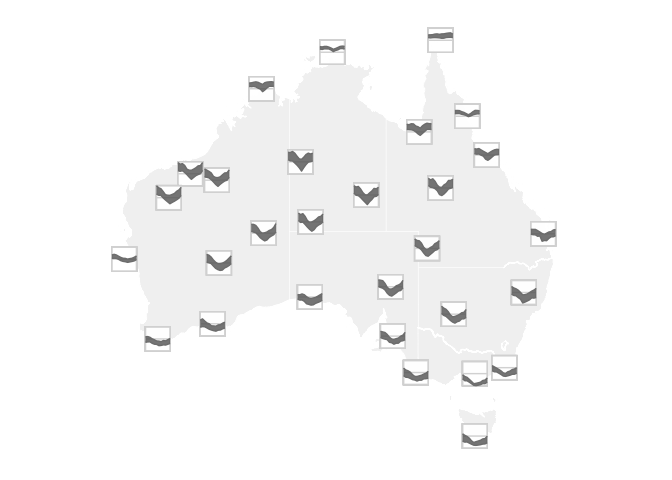

# ribbon

### Overview

ribbon provides ggplot2 extension to produce glyph plots with
`geom_glyph_ribbon()`, `add_glyph_boxes()` and `add_ref_lines()`.

These functions create a ribbon geometry designed to display glyphs
based on the combination of `x_major` and `y_major`. For each `x_minor`
value, `geom_glyph_ribbon()` displays a y interval defined by
`ymin_minor` and `ymax_minor`.

``` r
library(ribbon)
library(sf)
library(ggplot2)

aus_temp |>
  ggplot(aes(x_major = long, y_major = lat,
            x_minor = month, ymin_minor = tmin, ymax_minor = tmax)) +
  geom_sf(data = ozmaps::abs_ste, fill = "grey95",
          color = "white", inherit.aes = FALSE) +
  add_glyph_boxes() +
  add_ref_lines() +
  geom_glyph_ribbon() +
  coord_sf(xlim = c(113, 154)) +
  theme_glyph()
```

<!-- -->

### Installation

``` r
# Download the development version from GitHub:
devtools::install_github("maliny12/ribbon")
```

### Usage

See the [examples](#examples) page to learn more about how to use ribbon
in your project. [examples](#examples):
<https://maliny12.github.io/ribbon/articles/Examples.html>

### Examples

Click one of the images below to go to see the code example: <a
href="https://maliny12.github.io/ribbon/articles/Examples.html#comparison-between-global-rescale-and-local-rescale"
width="250px"></a>
