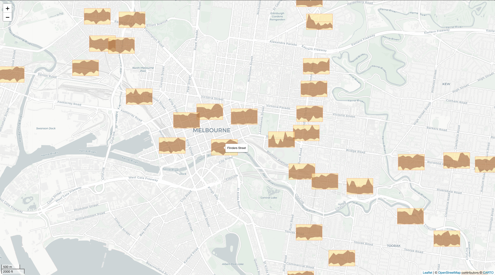
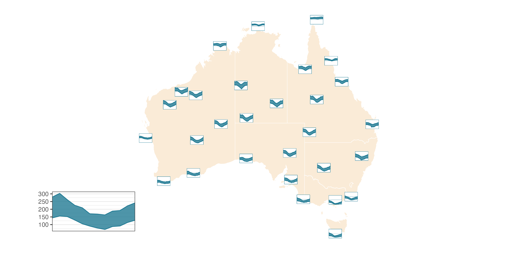
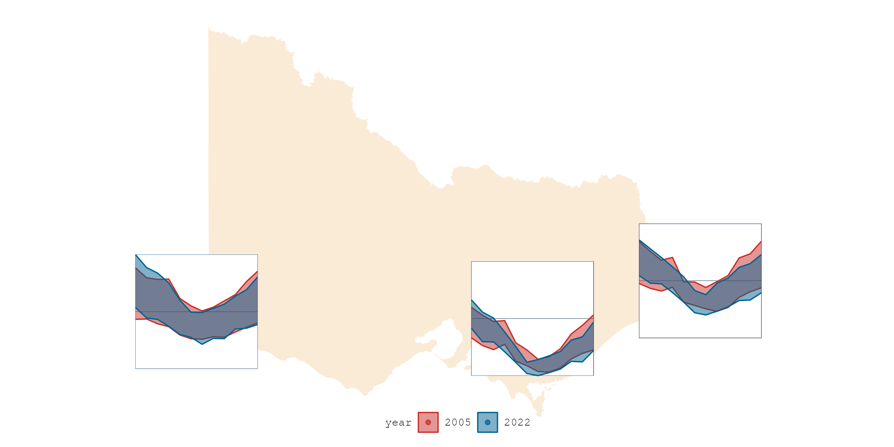

<!-- README.md is generated from README.Rmd. Please edit that file -->

# sugarglider

<!-- badges: start -->

[](https://github.com/maliny12/sugarglider/actions/workflows/R-CMD-check.yaml)

<!-- badges: end -->

## Overview

`sugarglider` provides ggplot2 extensions to create glyph maps that
visualize seasonal aspects of spatio-temporal data with
`geom_glyph_ribbon()` and `geom_glyph_segment()`.

These functions create a ribbon or segment geometry designed to display
glyphs based on the combination of `x_major` and `y_major`. For each
`x_minor` value, `geom_glyph_ribbon()` displays a y interval defined by
`ymin_minor` and `ymax_minor`. Meanwhile, `geom_glyph_segment()` draws a
straight line between `y_minor` and `yend_minor` with respect to
`x_minor`.


## Installation

``` r
# Download the development version from GitHub:
devtools::install_github("maliny12/sugarglider")
```

## Usage

See the
[examples](https://maliny12.github.io/sugarglider/articles/Examples.html)
page to learn more about how to use sugarglider in your project.

| [](https://maliny12.github.io/sugarglider/articles/sugarglider.html) |    [](https://maliny12.github.io/sugarglider/articles/Examples.html)    |
|:------------------------------------------------------------------------------------------------------------------:|:--------------------------------------------------------------------------------------------------------------:|
|      [](https://maliny12.github.io/sugarglider/articles/Examples.html)      | [](https://maliny12.github.io/sugarglider/articles/sugarglider.html) |
