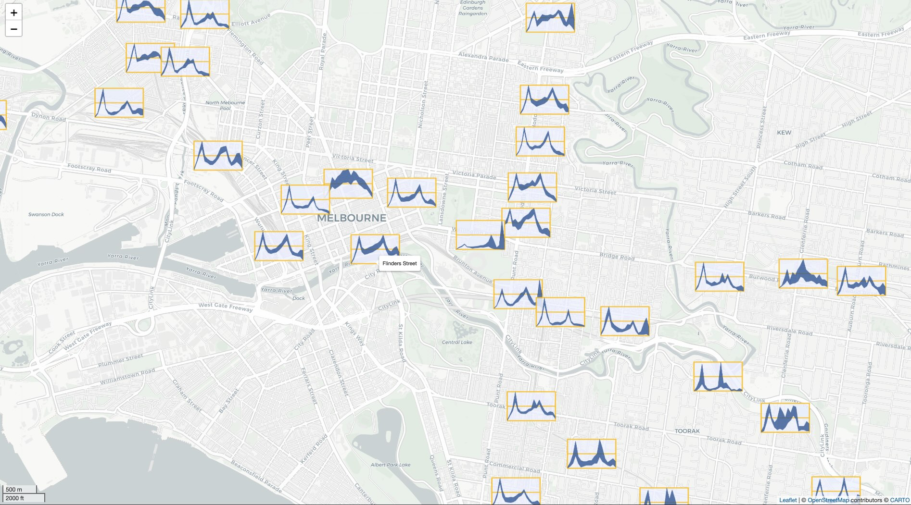

```{r, include = FALSE}
knitr::opts_chunk$set(
  collapse = TRUE,
  warning = FALSE,
  message = FALSE,
  fig.width = 10,
  fig.height = 8
)
```

```{r setup, echo=FALSE}
library(sugarglider)
library(knitr)
library(ggplot2)
library(sf)
library(tidyverse)
library(grid)
library(viridis)
library(gridExtra)
library(ozmaps)
library(ggthemes)
library(kableExtra)
library(usmap)
```

## Overview

The `sugarglider` package extends the capabilities of ggplot2 by introducing functions specifically designed for visualizing seasonal patterns in spatio-temporal data. It includes `geom_glyph_ribbon()` and `geom_glyph_segment()` , which represent measurements recorded over time at specific locations through the use of glyph maps. These functions enable clear depictions of seasonal trends by leveraging the combination of *x_major* and *y_major* coordinates. 

The structure of glyph maps in `sugarglider` consists of four main layers: the base map, glyph boxes, reference lines, and ribbon or segment glyphs. Additionally, users can create a legend, adding an extra layer to the glyph maps. Apart from the base map, sugarglider offers functionalities to generate all the elements of a comprehensive glyph map, as illustrated in the figure below.


Each layer can be plotted independently, and the package supports the creation of glyph plots using either ribbon or segment geometries. The core functionality includes:

* `geom_glyph_ribbon()`:  Displays an interval on the y-axis for each *x_minor* value, with the bounds defined by *ymin_minor* and *ymax_minor*. This function draws ribbon geometry using `geom_ribbon()` from ggplot2 to draw ribbon geometry, resulting in ribbon glyphs. Each glyph is plotted based on the combination of *x_major* and *y_major* coordinates. This functionality is particularly useful for visualizing ranges or uncertainties in the data.

* `geom_glyph_segment()`: Connects *y_minor* to *yend_minor* with a straight line using `geom_segment()` from ggplot2, resulting in segment glyphs. Each glyph is plotted based on the combination of *x_major* and *y_major* coordinates.

```{r, fig.height=6}
vic_temp <- aus_temp |>
  filter(id %in% c("ASN00026021", "ASN00085291", "ASN00084143"))

# Define a color palette
color_palette <- c("deepskyblue4", "coral3")

p1 <- vic_temp |>
   ggplot(aes(x_major = long,
              y_major = lat,
              x_minor = month,
              ymin_minor = tmin,
              ymax_minor = tmax)) +
  geom_sf(data = abs_ste |> filter(NAME == "Victoria"),
          fill = "antiquewhite", color = "white", inherit.aes = FALSE)  +
  # Customize the size of each glyph box using the width and height parameters.
  add_glyph_boxes(color = color_palette[1]) +
  add_ref_lines(color = color_palette[1]) +
  geom_glyph_ribbon(color = color_palette[1], fill = color_palette[1]) +
  # Theme and aesthetic
  theme_glyph() +
  labs(title = "geom_glyph_ribbon()") +
  theme(plot.title = element_text(hjust = 0.5),
        title = element_text(color = color_palette[1],
                             family  = "mono")) 

p2 <- vic_temp |>
   ggplot(aes(x_major = long,
              y_major = lat,
              x_minor = month,
              y_minor = tmin,
              yend_minor = tmax)) +
  geom_sf(data = abs_ste |> filter(NAME == "Victoria"),
         fill = "antiquewhite", color = "white", inherit.aes = FALSE)  +
  # Customize the size of each glyph box using the width and height parameters.
  add_glyph_boxes(color = color_palette[2]) +
  add_ref_lines(color = color_palette[2]) +
  geom_glyph_segment(color = color_palette[2]) +
  # Theme and aesthetic
  theme_glyph() +
  labs(title = "geom_glyph_segment()") +
  theme(plot.title = element_text(hjust = 0.5),
        title = element_text(color = color_palette[2]))

grid.arrange(p1, p2, ncol = 2) 
```

In addition to these two functions, sugarglider offers several other features that enhance the customization of glyph maps. The `add_ref_box()` function introduces reference boxes that visually frame individual glyphs, helping to define boundaries and distinguish glyphs from each other. The `add_ref_line()` function draws a horizontal midpoint for each glyph, facilitating comparisons across data points. The `add_glyph_legend()` function allows users to display an enlarged version of a randomly chosen glyph in the bottom-left corner of the panel, enabling users to visualize the data range. Lastly, the `theme_glyph()` function  provides a customized theme for glyph maps, built on top of `theme_map()` from `ggthemes`. It adjusts the plot's appearance, including the legend position, text styles, and background settings, to create a clean, visually consistent layout for glyph visualizations.

## Aesthetics

sugarglider provides the same aesthetics for `geom_glyph_ribbon()` and `geom_glyph_segment()` as those available in `geom_ribbon()` and `geom_segment()` from ggplot2. To include a variable in the glyph plot, it must be specified as an aesthetic. The functions in sugarglider expect spatial coordinates as the major axis and temporal data, along with some measurements, as the minor axis.

To produce glyph-maps, the following aesthetics are required:

|Aesthetics          | Description
|--------------- | ------------------------------------------------
|  `x_major`,`y_major`         | Spatial coordinates that define the position of glyphs.
|  `x_minor`         | Represents temporal data associated with each glyph.
|  `ymin_minor`, `ymax_minor`       | Used by `geom_glyph_ribbon()` to establish the lower and upper bounds of the ribbon geometry within each glyph.
|  `y_minor`, `yend_minor`       | Used by `geom_glyph_segment()` to set the start and end points of the segment geometry within each glyph.

The functions `add_ref_box()`, `add_ref_line()`, and `add_geom_legend()` are compatible with either *ymin_minor*, *ymax_minor*, or *y_minor*, *yend_minor*. Additionally, sugarglider introduces several customizable options to further tailor the visual aspects:

|Option          | Default      | Description
|--------------- | ------------ | ------------------------------------------------
| `colour`         | `"black"`         | Sets the color for line segments and borders.
|`linewidth`      | `0.5`          | Specifies the width of the line for borders.
|`linetype`         | `1`          |  Defines the style of the line for borders.
|`fill`     | `"black"`     | Determines the color of the interior area of the geometries.
|`alpha`      | `0.8`        | Controls the transparency level of the glyphs.

## Options

Options within the `sugarglider` package allow you to tailor the behavior of your visualizations to meet the specific needs of your analysis. The *global_rescale* argument provides control over whether rescaling should occur globally across all data points or be handled individually for each glyph.

`sugarglider` also offers a variety of customizable features to enhance the flexibility and precision of visualizations. For example, it facilitates the scaling of minor values within the glyph along both the x and y axes. Users can specify their own rescale function by replacing *"identity"* with a custom function in *x_scale* and *y_scale*. If a user wishes to modify the rescaling function on only one axis, they can replace the value of the corresponding parameter with their chosen function and retain "identity" for the other. In this package, "identity" rescale the minor axes to an interval of [-1,1]. The impact of rescaling on glyphs and its implications for visual interpretation will be thoroughly discussed in the upcoming section.

Additionally, the width and height of the glyphs are adjustable, allowing users to modify the appearance of each glyph to match the dimensions and scaling of the data being visualized. These customization options ensure that sugarglider can adapt to a broad range of data types and requirements, making it a versatile tool for seasonal spatiotemporal data visualization.

|Option          | Default      | Description
|--------------- | ------------ | ------------------------------------------------
| `x_scale`         | `"identity"`         | This function scales each set of minor values within a grid cell along the x-dimension.
|`y_scale`      | `"identity"`          | This function scales each set of minor values within a grid cell along the y-dimension.
|`width`         | `default`          |  The width of each glyph. The `default` is set to the smallest distance between two consecutive coordinates, converted from meters to degrees of latitude using the Haversine method.
|`height`     | `default`     | The height of each glyph. The `default` is calculated using the ratio (1:1.618) relative to the `width`, to maintain a consistent aspect ratio.
|`global_rescale`      | `TRUE`        | Determines whether rescaling is applied globally across all glyphs or individually for each glyph

## Interactivity

Interactive graphics are particularly useful when working with spatio-temporal data as they allow users to explore the data from multiple perspectives. The [cubble](https://huizezhang-sherry.github.io/cubble/articles/cb6interactive.html) package exemplifies this by creating linked interactive plots using `crosswalk::bscols()`. In this vignette, we will demonstrate how to create interactive glyph maps using Leaflet and ggiraph.

### Create glyph maps with leaflet

The dataset used in this example, `train`, provides a comprehensive monthly summary of hourly patronage at each train station in Victoria for the fiscal year 2023-2024. To create interactive glyph maps with Leaflet, we first need to save each glyph as a PNG and then add these to the Leaflet basemap as icons. The process starts by creating a list of unique train stations, then iterates through each station to generate ribbon glyphs using `geom_glyph_ribbon()`, `add_glyph_boxes()` and `add_ref_lines()`. Each glyph is saved in PNG format, and the file paths for all the PNGs are stored in an object for the next step.


```{r, eval=FALSE}
# Generate a list of unique train stations 
df_station <- train$station_name |> unique()

# Generate PNG of all the ribbon glyph
purrr::map(1:length(df_station), function(i) {
  dt <- train |> filter(station_name == df_station[i])
  p <- dt |>
  ggplot(aes(x_major = long, y_major = lat,
                   x_minor = hour, ymin_minor = min_weekday,
                   ymax_minor = max_weekday)) +
    add_glyph_boxes(color = "#ffc40d", 
                    fill = "#eff4ff", alpha = 0.5,
                    linewidth = 2, width = 3, height  =2) +
    add_ref_lines(color = "#ffc40d", alpha = 1,
                  linewidth = 2, width = 3, height  =2) +
    geom_glyph_ribbon(color = "#2b5797", fill = "#2b5797",
                      width = 3, height  =2) +
    theme_void() 
  
  file_path <- paste0("../man/figures/glyph_", df_station[i], ".png")
  ggsave(file_path, plot = p, width = 3, height = 2, units = "in",
         path = "../man/figures")

  }) -> train_png 

```

To create the base map for Leaflet, we use the `leaflet()` function and `addProviderTiles()` with [CartoDB.Positron](https://github.com/CartoDB/basemap-styles) as the provider to achieve a light, grey map aesthetic. Additionally, a scale bar is added at the bottom left corner for reference.

```{r, eval=FALSE}
# Create a leaflet map 
leaflet_map <- leaflet() |>
  addProviderTiles("CartoDB.Positron") |>
  addScaleBar(position = "bottomleft")
```

Next, we iterate through all the PNG files and convert them into icons using the `makeIcon()` function. Users can control the dimensions of each icon by modifying the `iconWidth` and `iconHeight` arguments. The final step is to add each icon to the Leaflet map using `addMarkers()`. Within the options argument of `addMarkers`, users can fine-tune each glyph's display properties, such as the opacity level. The `label` argument allows users to specify the information they wish to display with the hover-over effect, which in this example is set to display the station ID.

```{r, eval=FALSE}
# Loop through the PNG files and add them to the map
for (i in seq_along(train_png)) {
  icon <- makeIcon(iconUrl = train_png[i], iconWidth = 100, iconHeight = 60)

  dt <- train |> filter(station_name == df_station[i])
  leaflet_map <- leaflet_map |>
    addMarkers(lng = dt$long[1], lat = dt$lat[1], icon = icon,
               label = dt$station_name, options = markerOptions(opacity = 0.1))
}

leaflet_map
```




